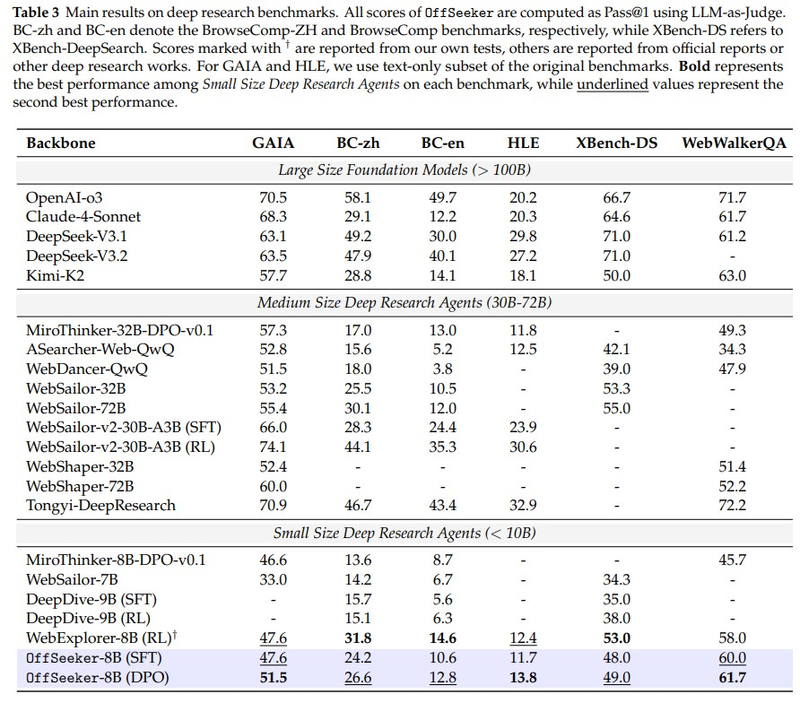
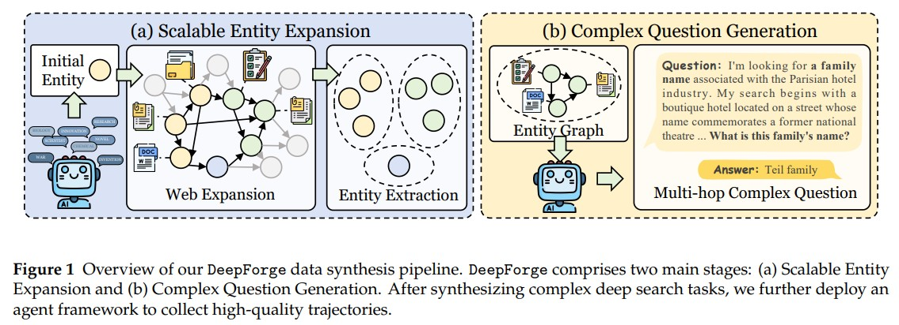

<h1 align="center">
OffSeeker: Online Reinforcement Learning Is Not All You Need for Deep Research Agents
</h1>

<p align="center">| <a href="https://arxiv.org/abs/2601.18467"><b>📰 Paper</b></a> | <a href="https://huggingface.co/datasets/OffSeeker/DeepForge"><b>🤗 Datasets</b></a> | <a href="https://huggingface.co/OffSeeker/OffSeeker-8B-DPO"><b>🤗 Models</b></a> | </p>

<!-- ---

🌟 We are currently organizing and preparing the code. It will be available soon! -->

---

<!-- [](https://arxiv.org/abs/2601.18467) [](https://huggingface.co/OffSeeker/OffSeeker-8B-DPO) [](https://huggingface.co/datasets/OffSeeker/DeepForge) [](LICENSE) -->

## 🌟 Abstract

We introduce a fully open-source suite designed for effective offline training. Our core contributions include DeepForge, a ready-to-use task synthesis framework that generates large-scale research queries without heavy preprocessing; and a curated collection of 66k QA pairs, 33k SFT trajectories, and 21k DPO pairs. Leveraging these resources, we train OffSeeker (8B), a model developed entirely offline. Extensive evaluations across six benchmarks show that OffSeeker not only leads among similar-sized agents but also remains competitive with 30B-parameter systems trained via heavy online RL.



---

## 📦 Project Structure

```text
OffSeeker/
├── deepforge/         # Data synthesis framework (DeepForge)
├── inference/          # Deep research inference and evaluation framework
└── training_scripts/   # Model training (SFT/DPO) configurations
```

### 1. [DeepForge](./deepforge/) (Data Synthesis)
DeepForge automates the generation of complex research tasks by constructing entity-centric knowledge graphs. It is ready-to-use for generating large-scale research queries without heavy preprocessing.




### 2. [Training Scripts](./training_scripts/) (Offline Training)
We provide the training recipes used to develop OffSeeker (8B) using offline data. We use [360-llamafactory](https://github.com/Qihoo360/360-LLaMA-Factory) to enable sequence-parallel training.
- **SFT**: Alignment with research trajectories to master tool use and reasoning.
- **DPO**: Preference optimization to refine decision-making in long-horizon research tasks.

### 3. [Inference](./inference/) (Agent Framework)
The inference framework provides the environment for the agent to interact with the web.
- **Tool Suite**: Integrated support for Google Search (Serper), Web Crawling (Jina/html2text), Wikipedia, and a Python Interpreter.
- **vLLM Support**: Optimized for local deployment and batch evaluation.

---

## 📊 Resources & Datasets


We are releasing our complete dataset to support the research community in offline agent training.

| Resource | Quantity | Description |
| :--- | :--- | :--- |
| **Research QA Pairs** | 66,000 | Complex questions requiring multi-hop search |
| **SFT Trajectories** | 33,000 | Step-by-step reasoning and tool-use paths |
| **DPO Pairs** | 21,000 | Preference pairs for refining agent behavior |
| **OffSeeker Model** | 8B | Competitive with 30B-parameter online RL models |

---

## 📖 Citation

If you find this work useful for your research, please cite our paper:

```bibtex
@article{zhou2026offseeker,
  title={OffSeeker: Online Reinforcement Learning Is Not All You Need for Deep Research Agents},
  author={Zhou, Yuhang and Zheng, Kai and Chen, Qiguang and Hu, Mengkang and Sun, Qingfeng and Xu, Can and Chen, Jingjing},
  journal={arXiv preprint arXiv:2601.18467},
  year={2026}
}
```