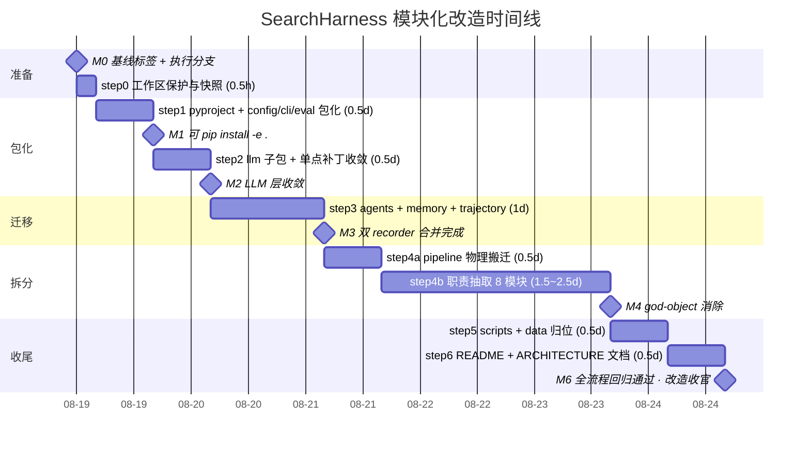

# SearchHarness 模块化改造设计

> **版本**：v1.0 · 2026-08-19
> **基线**：master `a67a50b`（+ 工作区未提交改动）；回归基线已实测：`python -m pytest tests/ -q` → **214 passed (16.6s)**
> **范围**：`SearchHarness_0425/` 目录整体模块化 —— 包化（src layout）+ god-object 拆分 + scripts 归位 + 契约/LLM 层规整
> **状态**：设计评审稿（待执行）。每一步都以"测试保持 214 绿"为提交门禁。
> **总入口**：统一问题清单与优先级见 [`ROADMAP.md`](./ROADMAP.md)。

---

## 0. 结论速览

1. 当前代码**领域分层拓扑本身是健康的**（pipeline → agents → memory/tools → llm 基建，几乎无环），问题集中在**物理组织**：34 个顶层裸名模块、god-object、脚本/库混用。因此改造以**搬运 + 收敛**为主，**不改行为**，风险可控。
2. 目标结构采用业界 eval harness 通行的 **src layout 单包**：`src/search_harness/{contract, config, llm, memory, tools, agents, trajectory, pipeline, eval, cli}` + `scripts/{run, smoke, analysis}` + `tests/` 镜像 + `data/`。
3. `search_harness_pipeline_v4.py`（3153 行）采用**"瘦壳 Facade + 纯函数 helper 模块 + 类属性重绑定"**策略拆分：既消掉 god-object，又保持 tests 直接引用的 5 个私有方法名（`_decide_concurrency` 等）在类上可达，**不破坏现有测试**。

| 改动面 | 数量 |
|---|---|
| 顶层 .py 文件 | 36 → 0（全部归入 src/ 或 scripts/） |
| 新建包 | 10 个子包 + `pyproject.toml` |
| 纯 `git mv` | 约 28 个文件 |
| 需拆分的文件 | 2 个（`run_browsecomp.py` 一分为三；`search_harness_pipeline_v4.py` 一分为九） |
| 需合并的文件 | 2 个（双 trajectory recorder 合一） |
| 新增文件 | `pyproject.toml`、10 个 `__init__.py`、`contract/` 4 个契约模块 |

---

## 1. 现状诊断

### 1.1 依赖怪癖清单（全部经源码核实）

| # | 怪癖 | 证据（文件:行） | 影响 |
|---|---|---|---|
| Q1 | **裸名导入**：全部模块间 `from search_memory import ...`，依赖 `SearchHarness_0425/` 在 `sys.path` 上 | `tests/conftest.py:25-28`（sys.path hack）；所有顶层 .py 的 import 段 | 无法 pip 化；改任何模块名即全局崩溃；IDE 跳转/重构失效 |
| Q2 | **god-object**：`SearchHarnessPipelineV4` 3153 行、约 55 个方法，单类承担编排循环/阶段机/候选池/验证队列/子任务并发/反馈 hooks/轨迹写入/收尾策略 8 类职责 | `search_harness_pipeline_v4.py:38-3153`；`run()` 方法本体约 500 行（:145-648） | 单点难改；`__init__` 每次 `run()` 重建全家桶组件（:145-200）导致并发复用脆弱 |
| Q3 | **脚本与库混用**：`run_browsecomp.py` 既是 CLI 入口又被 **4 个脚本当库 import** | `build_results_from_trajectories.py:46`、`regrade_results.py:46`、`run_browsecomp_fixed_sample.py:25`、`run_single_verify.py:31`；另有 `run_seed_repeats.py` 以 subprocess 包装调用（其 import 段仅 stdlib） | 入口无法独立演进；私有符号 `_decrypt` 被跨文件引用 |
| Q4 | **双 trajectory recorder 分叉**：旧版 248 行/12 方法 vs 增强版 805 行/20+ 方法，API 重叠但分叉 | `trajectory_recorder.py` vs `trajectory_recorder_enhanced.py`；`search_harness_pipeline_v4.py:25-26` 同时 import 两者；pipeline `run()` 内事件回调调用仅增强版才有的 `record_event` | 维护双倍；旧类实际已不满足 pipeline 的运行时需求，只剩注解用途 |
| Q5 | **配置三轨并存**：`config.settings()` / 模块内散点 `os.getenv` / 顶层常量 | `config.py`；`search_harness_pipeline_v4.py:90-143`（`__init__` 直读 8+ 个 env：PLANNER_TEMPERATURE、VERIFY_RANK_ENABLED、REFLEXION_ENABLED…）；`run_browsecomp.py:74` `DEFAULT_MODEL_ID` | 同一开关多处读取易漂移；测试需猜 env 清单 |
| Q6 | **私有 API 跨文件引用**：`from query_critic import _normalize_query`；tests 直接抓取未绑定私有方法 | `search_agent_v3.py:27`；`tests/test_concurrency.py:30-33,160` 引用 `_decide_concurrency / _next_subtasks_batch / _subtask_from_step / _plan_source_recommendations / _run_subtasks_concurrent` | 拆分/改名被测试硬绑定，必须设计兼容机制 |
| Q7 | **conftest 点对点 monkeypatch**：硬编码 8 个消费模块名清单逐一补丁 `build_openai_client` | `tests/conftest.py:33-42`（`LLM_CLIENT_CONSUMERS`） | 模块改名必须同步改清单；新增消费方漏改即打真网络 |
| Q8 | **数据/资源文件与代码平铺**：4 个 prompt md、`model_profiles.yaml`、数据集 csv/json 散在顶层与 docs/ | `planning_agent_v3.py:52,89`、`search_agent_v3.py:50,117`（`__file__` 相对加载）；`run_browsecomp_fixed_sample.py:29`（`docs/browse_comp_test_set.csv`）；`model_profiles.py:35`（yaml 与 py 同目录加载） | 包化后资源路径必须一并迁移，加载方 2 行改动 |
| Q9 | **vendor tools 私有函数被 scripts 直取**：`from tools.search_tools import _call_serper_api, _postprocess_serper_results` | `verify_source_accuracy.py:33` | 越过 `tools/__init__` 表面，vendor 升级即破 |

> ✅ **正面现状**（保留不动）：`tools/` 已 vendor 固化且带干净表面（`tools/__init__.py`）；领域依赖方向基本单向（见 §1.2）；`config.py`/`llm_client.py` 已是前人收敛的成果，只需搬家。

### 1.2 实测依赖图（bare-name，A → B 表示 A 依赖 B）

| 层 | 模块 | 依赖（项目内） |
|---|---|---|
| 入口/脚本 | `run_browsecomp.py` | llm_reasoning_compat, llm_error_utils, openai_client_factory（+ 运行期构造 pipeline/recorder） |
| | `run_single_verify.py` / `smoke_test_*.py` | run_browsecomp, search_harness_pipeline_v4, trajectory_recorder_enhanced |
| | `regrade_results.py` / `build_results_from_trajectories.py` / `run_browsecomp_fixed_sample.py` | run_browsecomp（库式） |
| 编排 | `search_harness_pipeline_v4.py` | search_memory, planning_agent_v3, search_agent_v3, config, search_finalizer, subtask_critic, planning_direction_critic, trajectory_recorder(+_enhanced), llm_reasoning_compat, openai_client_factory, query_history, query_critic, search_crawl_controller, tools.search_tools |
| Agent | `search_agent_v3.py` | tools.tool_processor, tools.search_tools, search_memory, query_history, **query_critic(含私有 `_normalize_query`)**, search_crawl_controller, llm_reasoning_compat, openai_client_factory, llm_error_utils |
| | `planning_agent_v3.py` | llm_reasoning_compat, openai_client_factory |
| | `search_crawl_controller.py` | query_history, llm_reasoning_compat, openai_client_factory, config |
| | `search_finalizer.py` | llm_reasoning_compat, llm_error_utils, openai_client_factory, **answer_verifier** |
| | `answer_verifier.py` | llm_reasoning_compat, openai_client_factory |
| Critic | `query_critic.py` | query_history, llm_reasoning_compat, openai_client_factory, config |
| | `subtask_critic.py` | llm_reasoning_compat, openai_client_factory, config |
| | `planning_direction_critic.py` | llm_reasoning_compat, openai_client_factory |
| 状态 | `search_memory.py` / `query_history.py` | 仅 stdlib + loguru ✅ 干净的叶子 |
| LLM 基建 | `llm_client.py` | openai_client_factory |
| | `llm_reasoning_compat.py` | model_profiles |
| | `openai_client_factory.py` / `llm_error_utils.py` / `model_profiles.py` | 仅 stdlib ✅ 叶子 |
| 轨迹 | `trajectory_recorder{,_enhanced}.py` | 仅 stdlib + loguru ✅ 叶子 |
| Tools | `tools/`（vendored） | 无项目内依赖 ✅ |

**结论**：无循环依赖；唯一"坏边"是 `search_agent_v3 → query_critic._normalize_query`（私有符号）与 scripts → tools 私有函数。分层重构有良好地基。

---

## 2. 业界基准对照

| 框架 | 结构模式 | 可借鉴点 | 本项目落点 |
|---|---|---|---|
| **EleutherAI lm-evaluation-harness** | `lm_eval/` 单包：`api/`（task/model 抽象 + `registry.py` 装饰器注册）、`tasks/`、`models/`、`evaluator.py`、`__main__.py` CLI | ① 可插拔组件走**注册表/工厂**而非硬编码 import；② 评测器与模型适配解耦 | `agents/` 各 critic 可先以显式构造注入（短中期不引装饰器注册表——YAGNI）；`cli/browsecomp.py` 对应 `__main__.py` |
| **Stanford HELM** | `helm/{common, proxy, benchmark}` 三包严格分层，依赖单向 common←proxy←benchmark | **分层 + 单向依赖规则**是大型 harness 可维护性的根 | §4 的 L0–L5 分层与禁止规则直接照搬该思想 |
| **OpenAI evals** | `evals/` 包：`registry.py`（yaml 注册）、`evals/`（评测类）、`solvers/`（模型封装）、`data/` 独立、`cli/oaieval.py` 入口 | ① **数据与代码分离**；② 入口是薄壳 argparse，业务全在包里 | `data/` 接收 docs/ 下 csv/json；`cli/browsecomp.py` 只做 argparse → 调用 `eval/` 服务层 |
| **OpenHands** | `openhands/{core, controller, agenthub, llm, events, memory, runtime}`：`events/` 契约先行，`controller/` 只做状态机编排，`agenthub/` 放 agent 实现 | ① **契约层（events）独立成包**，一切跨层数据结构先落契约；② controller 瘦壳、agent 可插拔；③ `llm/` 统一客户端子包 | `contract/` 子包（§6）；`pipeline/orchestrator.py` 瘦壳；`llm/` 子包（§7） |
| **SWE-bench harness** | `swebench/harness/{run_evaluation, docker_build, grading, test_spec, constants, utils}`：入口/执行/评分/规格/常量分文件 | ① **评分（grading）与执行分离**；② 常量集中；③ 每文件单一职责 | `eval/grader.py`（LLMGrader + GRADER_PROMPT）独立于 `eval/browsecomp.py`（执行）；`config/settings.py` 收口 switch 读取 |

**共性提炼（落为设计的 5 条公理）**：

1. 单包化：一个可 `pip install -e .` 的包，CLI 是包内薄壳（`python -m` / console script）。
2. 分层单向：contract < infra（llm/config/tools/memory/trajectory）< domain（agents）< orchestration（pipeline）< service（eval）< entry（cli/scripts），禁止反向。
3. 契约先行：跨模块数据结构（Message/CandidateRecord/Trajectory/RunResult）集中在独立契约层。
4. 资源即包数据：prompt/yaml/数据集随包搬（`importlib.resources` 或同目录 `__file__` 约定），不依赖 CWD。
5. tests 镜像包结构；scripts 是"可执行工具"，**任何业务代码不得 import scripts**。

---

## 3. 目标包结构

### 3.1 目录树

```
SearchHarness_0425/
├── pyproject.toml                       # 新增：包定义 + pytest pythonpath + console script
├── requirements.txt                     # 不变
├── README.md                            # step6 更新目录结构节
├── .gitignore                           # 不变
│
├── src/search_harness/
│   ├── __init__.py                      # __version__ + 惰性 re-export 顶层入口
│   ├── config/
│   │   ├── __init__.py                  # re-export: settings, Settings, LLMConfig, ...
│   │   └── settings.py                  # ← config.py（整体搬运，零改动）
│   ├── contract/
│   │   ├── __init__.py                  # re-export 全部契约
│   │   ├── trajectory.py                # TrajectoryEvent, TrajectoryDoc（轨迹 JSON schema）
│   │   ├── agent.py                     # Plan, PlanStep, Subtask, SubtaskResult, Findings
│   │   ├── candidate.py                 # CandidateRecord, QueryRecord, QueryVerdict
│   │   └── run.py                       # PipelineOptions, RunResult, GradeResult, TaskResult
│   ├── llm/
│   │   ├── __init__.py                  # re-export 收敛后的 ~10 个公开符号（§7）
│   │   ├── factory.py                   # ← openai_client_factory.py
│   │   ├── client.py                    # ← llm_client.py（缓存 + 重试）
│   │   ├── compat.py                    # ← llm_reasoning_compat.py
│   │   ├── errors.py                    # ← llm_error_utils.py
│   │   ├── profiles.py                  # ← model_profiles.py
│   │   └── profiles.yaml                # ← model_profiles.yaml（包数据，随 profiles.py 走）
│   ├── memory/
│   │   ├── __init__.py                  # re-export: SearchStateStore, QueryHistoryMemory, QueryRecord, ToolObservation
│   │   ├── search_state.py              # ← search_memory.py
│   │   └── query_history.py             # ← query_history.py
│   ├── tools/                           # ← tools/ 整体 git mv（vendored，内容冻结）
│   │   └── __init__.py                  # 现有表面不变；新增 re-export 两个被业务引用的来源函数
│   ├── agents/
│   │   ├── __init__.py                  # re-export: PlanningAgentV3, SearchAgentV3, SearchFinalizer, SearchCrawlController, 各 Critic
│   │   ├── planner.py                   # ← planning_agent_v3.py
│   │   ├── searcher.py                  # ← search_agent_v3.py
│   │   ├── crawl_controller.py          # ← search_crawl_controller.py
│   │   ├── finalizer.py                 # ← search_finalizer.py
│   │   ├── verifier.py                  # ← answer_verifier.py
│   │   ├── critics/
│   │   │   ├── __init__.py              # re-export: QueryCritic, QueryVerdict, SubtaskCritic, DirectionCritic, SUGGEST_PIVOT, normalize_query
│   │   │   ├── query.py                 # ← query_critic.py（_normalize_query → 公开名 normalize_query + 旧别名）
│   │   │   ├── subtask.py               # ← subtask_critic.py
│   │   │   └── direction.py             # ← planning_direction_critic.py
│   │   └── prompts/                     # 包数据（纯搬运）
│   │       ├── planner_v3.md            # ← planning_agent_prompt_v3.md
│   │       ├── planner_simple.md        # ← planning_agent_prompt_simple.md
│   │       ├── searcher_v3.md           # ← search_agent_prompt_v3.md
│   │       └── searcher_simple.md       # ← search_agent_prompt_simple.md
│   ├── trajectory/
│   │   ├── __init__.py                  # re-export: TrajectoryRecorder（+ 别名 TrajectoryRecorderEnhanced）
│   │   └── recorder.py                  # 两 recorder 合并实现（以 enhanced 为准）
│   ├── pipeline/
│   │   ├── __init__.py                  # re-export: SearchHarnessPipelineV4
│   │   ├── orchestrator.py              # 瘦壳：__init__ 组装 + run() 主循环 + _check_stop
│   │   ├── stages.py                    # 工作流阶段状态机
│   │   ├── candidates.py                # 候选池管理
│   │   ├── verification.py              # 验证队列 + 早停策略
│   │   ├── subtasks.py                  # 子任务调度 + 并发执行
│   │   ├── feedback.py                  # Reflexion / CRAG / DirectionCritic hooks
│   │   ├── finish.py                    # best-effort 收尾 / wrap-up
│   │   └── tracing.py                   # 轨迹事件写入
│   ├── eval/
│   │   ├── __init__.py                  # re-export: LLMGrader, run_evaluation, run_single_task, resolve_*, extract_answer_from_pipeline
│   │   ├── decrypt.py                   # ← run_browsecomp.py 的 _decrypt/_derive_key（公开名 decrypt）
│   │   ├── grader.py                    # ← LLMGrader + GRADER_PROMPT + resolve_primary_model/resolve_grader_config
│   │   └── browsecomp.py                # ← extract_answer_from_pipeline, run_single_task, run_evaluation
│   └── cli/
│       ├── __init__.py
│       └── browsecomp.py                # ← run_browsecomp.py 的 main()/argparse 薄壳
│
├── scripts/                             # 可执行工具（业务代码禁止 import 本目录）
│   ├── run/
│   │   ├── run_browsecomp.py            # 兼容壳：from search_harness.cli.browsecomp import main（保留 muscle memory）
│   │   ├── run_browsecomp_fixed_sample.py
│   │   ├── run_seed_repeats.py          # subprocess 包装，改入口命令名即可
│   │   └── run_single_verify.py
│   ├── smoke/
│   │   ├── smoke_test_simple.py
│   │   ├── smoke_test_thinking.py
│   │   ├── debug_llm_smoke.py
│   │   └── debug_serper_smoke.py
│   └── analysis/
│       ├── regrade_results.py
│       ├── build_results_from_trajectories.py
│       ├── build_seed123_k10_full.py
│       ├── analyze_failed_subtasks.py
│       ├── diagnose_trajectories.py
│       ├── failure_taxonomy.py
│       └── verify_source_accuracy.py
│
├── data/                                # 数据集与固定子集
│   ├── browse_comp_test_set.csv         # ← docs/browse_comp_test_set.csv
│   ├── seed123_k10_full.json            # ← docs/
│   └── seed123_*_manifest.json          # ← docs/
│
├── tests/                               # 镜像包结构（step4/5 逐步镜像；conftest 收敛）
│   ├── conftest.py                      # 改：去掉项目根 sys.path hack + LLM_CLIENT_CONSUMERS 收敛为单点补丁
│   ├── test_*.py                        # 现有文件仅改 import；可选新增 pipeline/ agents/ llm/ 子目录镜像
├── docs/                                # 仅留报告/设计文档（数据集移出）
├── results/  logs/                      # 运行时产物（gitignore，不变）
└── third_party/                         # （保留但不使用；tools/ 已 vendor，可后续删除）
```

### 3.2 模块职责一览

| 包 | 职责（单一） | 收纳的现有文件/类 |
|---|---|---|
| `config` | 环境变量 → 不可变 Settings；唯一 env 收口 | `config.py` |
| `contract` | 跨层数据结构定义（无逻辑、无对内 import） | 新建；吸收现有的 `ToolObservation`、`QueryRecord`、`QueryVerdict` 等散点数据类（保留原处别名） |
| `llm` | OpenAI 客户端构造/缓存/重试/流式结构回退/错误分类/模型 profile | `openai_client_factory / llm_client / llm_reasoning_compat / llm_error_utils / model_profiles(+yaml)` |
| `memory` | 搜索状态存储与查询历史 | `search_memory.py / query_history.py` |
| `tools` | vendored 工具层（冻结，仅表面维护） | `tools/*` |
| `agents` | 单 Agent 实现：planner / searcher / crawl 控制 / 定稿 / 验证 / 三类 critic | `planning_agent_v3 / search_agent_v3 / search_crawl_controller / search_finalizer / answer_verifier / query_critic / subtask_critic / planning_direction_critic` + 4 个 prompt md |
| `trajectory` | 轨迹记录与落盘 | 双 recorder 合并 |
| `pipeline` | 多 agent 编排（唯一允许横向组合 agents 的层） | `search_harness_pipeline_v4.py` 拆分 |
| `eval` | BrowseComp 评测服务：批次执行、答案抽取、LLM 评分、解密 | `run_browsecomp.py` 的库部分 |
| `cli` | 命令行薄壳（argparse → eval） | `run_browsecomp.py` 的 `main()` |
| `scripts/` | 运维/分析/冒烟工具（业务代码禁止依赖） | 其余 14 个脚本 |
| `data/` | 数据集与 manifest | docs/ 下 csv/json |

### 3.3 各包 `__init__.py` re-export 清单

| `__init__.py` | re-export 内容 |
|---|---|
| `search_harness/__init__.py` | `__version__`；惰性（`__getattr__`）导出 `SearchHarnessPipelineV4`，避免 `import search_harness` 拉起全依赖链 |
| `config/__init__.py` | `settings, Settings, LLMConfig, GraderConfig, ToolsConfig, PromptConfig, LoggingConfig` |
| `contract/__init__.py` | `Message, ToolResult, CandidateRecord, Plan, PlanStep, Subtask, SubtaskResult, Findings, QueryVerdict-like, TrajectoryEvent, TrajectoryDoc, PipelineOptions, RunResult, GradeResult, TaskResult` |
| `llm/__init__.py` | `build_openai_client, get_llm_client, clear_llm_client_cache, llm_chat_completion, chat_completion_with_structuring, build_chat_completion_kwargs, assistant_message_to_dict, classify_infra_error, get_model_profile, ModelProfile` |
| `memory/__init__.py` | `SearchStateStore, QueryHistoryMemory, QueryRecord, ToolObservation, SearchSnapshot` |
| `tools/__init__.py` | 现有 8 个符号不变；追加 `authoritative_domains_in, high_weight_sources_in`（现被 searcher/pipeline 直取 `tools.search_tools`） |
| `agents/__init__.py` | `PlanningAgentV3, SearchAgentV3, SearchCrawlController, SearchFinalizer, AnswerVerifier`(+critics 三项) |
| `agents/critics/__init__.py` | `QueryCritic, QueryVerdict, SUGGEST_PIVOT, normalize_query（别名 _normalize_query）, SubtaskCritic, DirectionCritic` |
| `trajectory/__init__.py` | `TrajectoryRecorder`；`TrajectoryRecorderEnhanced = TrajectoryRecorder`（过渡别名，一个阶段后删） |
| `pipeline/__init__.py` | `SearchHarnessPipelineV4` |
| `eval/__init__.py` | `LLMGrader, GRADER_PROMPT, run_evaluation, run_single_task, extract_answer_from_pipeline, resolve_primary_model, resolve_grader_config, decrypt` |

---

## 4. 模块边界与依赖规则

### 4.1 分层图（上层可依赖下层，反之禁止）

```
L5  cli/ ──────────────────────────────── 入口薄壳
      ↓
L4  eval/  (browsecomp 执行 · grader 评分 · decrypt)
      ↓
L3  pipeline/  (orchestrator = 唯一横向组合 agents 的位置)
      ↓
L2  agents/  (planner · searcher · finalizer · verifier · critics · crawl_controller)
      ↓
L1  llm/   config/   memory/   tools/   trajectory/   ←—— 互相隔离的基建叶子
      ↓
L0  contract/  (纯数据结构)

旁挂：scripts/ → 可 import 任意层；任何层禁止 import scripts/
```

### 4.2 禁止规则（写入 README + 可选 import-linter 强制）

| # | 规则 | 理由 |
|---|---|---|
| R1 | `contract/` 禁止 import 任何本项目其他模块 | 契约层是被依赖的底 |
| R2 | L1 各叶子（llm/config/memory/tools/trajectory）互相禁止 import；唯一例外：`llm` 可读 `config` 之外——**不例外，llm 也不读 config**，由调用方传参 | 保持叶子可独立替换/单测 |
| R3 | `memory/`、`tools/`、`trajectory/`、`llm/` 禁止 import `agents/`、`pipeline/`、`eval/` | 防反向依赖 |
| R4 | `agents/` 内部互不 import（planner 不得 import searcher 等）；协作经 `pipeline/` 编排 | 现状已满足，固化为规则 |
| R5 | 禁止跨包引用下划线私有符号（`_foo`）；需要的工具函数提升为公开名（如 `normalize_query`） | 消灭 Q6 怪癖 |
| R6 | `tools/`（vendored）只能通过 `tools/__init__` 表面使用；scripts 也不例外 | vendor 可升级性 |
| R7 | 任何层禁止 `sys.path` 操作；靠 editable install / pytest `pythonpath` | 消灭 Q1 怪癖 |
| R8 | 业务代码禁止 import `scripts/`；应用代码也不得 import `cli/`（除 `__main__` 路径） | 入口单向 |

---

## 5. `search_harness_pipeline_v4.py`（3153 行）拆分方案

### 5.1 策略：两子步、行为不变

- **step4a（物理搬迁）**：整文件 `git mv` 为 `pipeline/orchestrator.py`，仅改 import。此时类原样存在，一切照旧。
- **step4b（职责抽取）**：把约 55 个方法按下表抽成 **8 个纯函数 helper 模块**；`SearchHarnessPipelineV4` 变瘦壳：`__init__` 只做组件组装、`run()` 只做主循环骨架，其余以**类属性重绑定**保留私有名可达：

```python
# pipeline/orchestrator.py（示意）
from . import subtasks as _subtasks
from . import verification as _verification

class SearchHarnessPipelineV4:
    CANDIDATE_GENERATION = "candidate_generation"
    ...
    def __init__(self, ...): ...   # 组件组装（现状不变）
    def run(self, question, max_iterations=6, max_crawl_calls=12): ...  # 保留主循环骨架

    # 类属性重绑定：tests/test_concurrency.py:30-33,160 的未绑定方法抓取继续可用
    _decide_concurrency     = staticmethod(_subtasks.decide_concurrency)
    _next_subtasks_batch    = _subtasks.next_subtasks_batch          # (self, plan, k)
    _subtask_from_step      = _subtasks.subtask_from_step            # (self, step, plan)
    _run_subtasks_concurrent = _subtasks.run_subtasks_concurrent
    ...
```

> **为什么不用 mixin**：mixin 让方法"凭空出现"，pyflakes/IDE 不可见；纯函数 + 首参 `self` 显式可读、可独立单测。**为什么类属性重绑定**：现有测试直接引用未绑定私有函数（Q6），重绑定是最小代价的兼容机制，且未来测试可逐步改到直接测 helper 函数。

### 5.2 方法 → 模块映射表（按现行行号区间）

| 目标模块 | 现有方法（行号） | 估规模 |
|---|---|---|
| `orchestrator.py`（瘦壳） | `__init__`(:64)、`run`(:145–648 主循环)、`_check_stop`(:1793)、常量与 prompt 模板 | ~700 行 |
| `stages.py` 阶段状态机 | `_stage_context`(:648)、`_workflow_stage_from_plan`(:661)、`_sync_workflow_stage_from_plan`(:684)、`_prepare_plan_for_stage`(:1017)、`_normalize_plan_steps_for_stage`(:1042)、`_should_advance_stage`(:1085)、`_advance_stage`(:1223)、`_build_stage_transition_feedback`(:1390)、`_maybe_advance_stage`(:1425, 含大段推进逻辑) | ~530 行 |
| `candidates.py` 候选池 | `_force_pool_rebuild`(:860)、`_mark_candidate_eliminated`(:900)、`_fallback_answer_from_pool`(:920)、`_all_candidate_records`(:1072)、`_viable_candidate_records`(:1078)、`_rank_verification_queue_by_question`*、`_current_candidate_record`(:1331)、`_should_rotate_active_candidate`(:1339)、`_rotate_active_candidate`(:1350)、`_should_rebuild_candidate_pool`(:1375)、`_infer_candidate_type_hints`(:2537)、`_infer_question_answer_type`(:2577)、`_check_pool_health`(:2629, ~280 行) | ~700 行 |
| `verification.py` 验证队列与早停 | `_consume_stage_answer`(:742)、`_pipeline_status_for_answer`(:750)、`_verify_planner_answer`(:770)、`_gate_verification_short_circuit`(:1144)、`_initialize_verification_queue`(:1233)、`_rank_verification_queue_by_question`(:1256)、`_verified_candidate_early_stop`(:1824)、`_tied_candidate_blocks_early_stop`(:1870)、`_authoritative_consensus_early_stop`(:1971) | ~570 行 |
| `subtasks.py` 子任务调度 | `_settle_subtask_with_critic`(:1624)、`_recover_missing_subtask`(:1705)、`_subtask_from_step`(:2257)、`_next_subtask_from_plan`(:2286)、`_next_subtasks_batch`(:2293)、`_decide_concurrency`(:2304)、`_build_executor_pool`(:2327)、`_run_subtasks_concurrent`(:2357)、`_plan_source_recommendations`(:2386)、`_subtask_guidance_for_critic`(:2402)、`_should_snapshot`(:2414)、`_fallback_findings`(:2418)、`_is_progress`(:2239) | ~480 行 |
| `feedback.py` 反思/CRAG/方向 | `_build_stagnation_feedback`(:2430)、`_build_gap_summary`(:2450)、`_direction_critic_context`(:2508)、`_reflect_on_elimination`(:2913)、`_assess_subtask_relevance`(:2983)、`_apply_direction_critic_action`(:3076) | ~360 行 |
| `finish.py` 收尾 | `_finish_with_answer`(:969)、`_best_effort_finish`(:2102)、`_build_wrap_up_state_excerpt`(:2169)、`_try_protocol_wrap_up`(:2187)、`_looks_solved`(:2229) | ~250 行 |
| `tracing.py` 轨迹事件 | `_record_candidate_snapshot_for_trajectory`(:2056)、`_record_event_for_trajectory`(:2070)、`_record_iteration_summary_for_trajectory`(:2079) | ~70 行 |

> helper 函数签名统一为 `(pipeline: "SearchHarnessPipelineV4", ...)`，内部仅读/写 `pipeline` 上的状态属性；跨 helper 的共享小工具（如 `_looks_solved`）放 `pipeline/_util.py` 或归入最近职责模块，禁止再建 `utils.py` 垃圾场。

---

## 6. 统一契约层 `contract/`

**决策**：用 **stdlib `@dataclass(slots=True, frozen=...)`** 先行，不新增 pydantic 依赖（保持安装面不变）；轨迹 JSON 在 `trajectory/recorder.py` 边界处手写轻量 `validate()`。若后续轨迹要外发训练管线，再独立引入 pydantic（P3）。

| 契约 | 关键字段 | 现状来源 | 放置 |
|---|---|---|---|
| `Message` | role, content, reasoning_content?, tool_calls? | 各处散 dict | `contract/trajectory.py` |
| `ToolResult` | tool_name, arguments, result, latency_ms?, ok | `search_memory.ToolObservation` 迁移 | `contract/trajectory.py`（memory 保留别名） |
| `CandidateRecord` | name, status(eliminated/verified/…), evidence, source_urls, type_hints | pipeline 内散 dict（`_viable_candidate_records` 等） | `contract/candidate.py` |
| `Plan` / `PlanStep` | steps, workflow_stage, status | planner 返回 dict | `contract/agent.py` |
| `Subtask` / `SubtaskResult` / `Findings` | subtask id/goal, verdict, findings | subtasks 相关散 dict | `contract/agent.py` |
| `QueryRecord` / `QueryVerdict` | query, verdict, suggestion | `query_history.QueryRecord`、`query_critic.QueryVerdict` 迁移（原处留别名） | `contract/candidate.py` |
| `TrajectoryEvent` | event_type, iteration, agent, data, ts_ms | `record_event` 散 dict | `contract/trajectory.py` |
| `TrajectoryDoc` | schema 常量（顶层键清单）+ `validate()` | 两 recorder 的 `_snapshot_payload/_build_trajectory` | `contract/trajectory.py` |
| `PipelineOptions` | max_iterations, budgets, flags | `run_evaluation(pipeline_kwargs)` 散 kwargs | `contract/run.py` |
| `RunResult` / `GradeResult` / `TaskResult` | answer, status, failure_category, iterations… / correct, extracted, reason | `pipeline.run()` 返回 dict；`run_single_task()` 返回 dict | `contract/run.py` |

**迁移纪律**：契约先落，业务代码**第一批只把"构造点"改为返回契约对象**，消费点继续容忍 dict（`dataclasses.asdict` 适配）；逐步收敛，绝不在一次提交里同时改生产者和消费者。

---

## 7. LLM 客户端层规整 → `llm/` 子包

| 现状文件 | 去向 | 改动 |
|---|---|---|
| `openai_client_factory.py`(42) | `llm/factory.py` | 零改动（叶子） |
| `llm_client.py`(118) | `llm/client.py` | 零改动；新增约定：**所有业务模块统一改调 `get_llm_client()`，禁止各自持有 `build_openai_client` 名字** |
| `llm_reasoning_compat.py`(691) | `llm/compat.py` | 零改动 |
| `llm_error_utils.py`(73) | `llm/errors.py` | 零改动 |
| `model_profiles.py`+yaml(207) | `llm/profiles.py`+`llm/profiles.yaml` | `model_profiles.py:35` 的 yaml 路径因同目录搬迁**自动正确** |

**测试补丁点收敛（消灭 Q7）**：现 conftest 要对 8 个模块逐一 `monkeypatch.setattr(mod, "build_openai_client", ...)`，根因是 `from x import y` 引用复制。规整后所有业务模块改经 `search_harness.llm.get_llm_client()` 取客户端 → conftest 只需补丁 **`search_harness.llm.client` 单点**（`get_llm_client` 返回 fake）。`LLM_CLIENT_CONSUMERS` 清单删除。

**调用方 import 机械替换映射**（9 个消费文件统一处理）：

| 旧 | 新 |
|---|---|
| `from openai_client_factory import build_openai_client` | `from search_harness.llm import build_openai_client`（仅 factory/client 内部留底；业务方优先 `get_llm_client`） |
| `from llm_reasoning_compat import ...` | `from search_harness.llm import ...` |
| `from llm_error_utils import classify_infra_error` | `from search_harness.llm import classify_infra_error` |
| `from llm_client import get_llm_client, ...` | `from search_harness.llm import get_llm_client, ...` |
| `from config import settings` | `from search_harness.config import settings` |

---

## 8. 迁移计划

> 门禁：每步结束 `python -m pytest tests/ -q` 必须 214 passed；每步独立 commit；任何一步红 → 该步 `git revert`/`git reset --hard`，不夹带前进。

### 8.0 时间线与里程碑（基准日 2026-08-19，总工期约 5 个工作日）



> 排期按"单人连续投入"估算；M4 与 M5 之间允许多日停留（step4a/4b 间结构已合法）。若并行两人，step2 与 step3 的 memory/trajectory 部分可重叠，总工期可压至 ~4 天。

### step0 —— 工作区保护与快照（0.5h）

| 项 | 内容 |
|---|---|
| 动作 | ① 提交现有工作区改动（或 `git stash` 清单化）；② 打基线标签 `git tag pre-refactor-baseline`；③ 建执行分支 `git checkout -b refactor/modularization`；④ 记录基线：`python -m pytest tests/ -q \| tee logs/baseline_pytest_214.txt`；⑤ 清 `__pycache__` 防旧模块遮蔽 |
| import 策略 | 无变更 |
| 回归 | `pytest tests/ -q` → 214 passed |
| 回滚 | `git checkout master && git branch -D refactor/modularization` |

### step1 —— pyproject 骨架 + config/cli/eval 包化（0.5d）

| 项 | 内容 |
|---|---|
| 动作 | ① 新建 `pyproject.toml`：`[project] name="search-harness"`、setuptools `package-dir={"":"src"}`、`[tool.pytest.ini_options] pythonpath=["src"]`、`[project.scripts] sh-browsecomp="search_harness.cli.browsecomp:main"`；② `pip install -e .`（或仅用 pytest pythonpath，安装可选）；③ 建空包骨架 `src/search_harness/{__init__, config/, eval/, cli/}`；④ 拆 `run_browsecomp.py`：`grader+decrypt→eval/`、`run_single_task/run_evaluation/extract→eval/browsecomp.py`、`main→cli/browsecomp.py`；⑤ 顶层留兼容壳 `run_browsecomp.py` → `scripts/run/run_browsecomp.py` 形态见 step5，本步先**原地改写为薄壳** `from search_harness.cli.browsecomp import main; main()` |
| git mv / 新建 | `config.py → src/search_harness/config/settings.py`；`run_browsecomp.py` 三分（手工拆分，非 mv） |
| import 迁移 | 4 个库式消费脚本改为 `from search_harness.eval import LLMGrader, decrypt, ...`；`run_seed_repeats.py` 的 subprocess 命令保持 `run_browsecomp.py` 兼容壳不变 |
| 回归 | `pytest tests/ -q` 214 passed + `python -m search_harness.cli.browsecomp --help` 可运行 |
| 回滚 | `git revert <step1-commit>` 或 `git reset --hard pre-refactor-baseline` |

### step2 —— llm 子包（0.5d）

| 项 | 内容 |
|---|---|
| 动作 | ① 按 §7 映射 `git mv` 五个文件 + yaml；② 业务 9 文件机械替换 import（上表）；③ 高阶改造：消费方从 `build_openai_client` 迁移到 `get_llm_client()`（逐文件小步提交）；④ conftest 的 `LLM_CLIENT_CONSUMERS` 收敛为补丁 `search_harness.llm.client` 单点，并保留兼容补丁直到 step3 全部消费方迁完 |
| git mv | `openai_client_factory.py→llm/factory.py`、`llm_client.py→llm/client.py`、`llm_reasoning_compat.py→llm/compat.py`、`llm_error_utils.py→llm/errors.py`、`model_profiles.py→llm/profiles.py`、`model_profiles.yaml→llm/profiles.yaml` |
| import 迁移 | 包内一律**绝对导入** `from search_harness.llm import ...`（不用相对导入：重构抗扰、grep 友好；`llm/__init__.py` 内部 re-export 可用相对导入） |
| 回归 | `pytest tests/ -q` 214 passed；`grep -rn "from llm_\|from openai_client_factory\|import llm_client" --include="*.py" .` 应无残留（除 llm/ 自身与兼容期标记） |
| 回滚 | `git revert`；若 import 替换出错面广，直接 `git reset --hard pre-refactor-baseline` 重来（成本低、无数据面风险） |

### step3 —— agents + memory + trajectory（1d）

| 项 | 内容 |
|---|---|
| 动作 | ① `memory`：两个文件入包；② `agents`：5 + 3 critic 入包，prompt md 入 `agents/prompts/`，两个 agent 的路径常量改为同目录 `prompts/` 子路径（各 2 行改动）或 `importlib.resources`；③ `query_critic._normalize_query` 提公开名 `normalize_query` + 旧别名，`search_agent_v3.py:27` 改引公开名；④ `trajectory`：合并双 recorder 为 `recorder.py`（以 enhanced 为准，类名 `TrajectoryRecorder` + 别名 `TrajectoryRecorderEnhanced`），删除旧 248 行实现，pipeline 双 import 合并为一处；⑤ `tools/` 整体入包位置 `src/search_harness/tools/`，`__init__` 追加白名单 re-export |
| git mv | 见附录 A 全量表 |
| 回滚 | 同上；recorder 合并单独一 commit，出问题单点 revert |

### step4 —— 大 pipeline 拆分（2-3d，两子步各独立 commit）

| 项 | 内容 |
|---|---|
| 动作 | **4a**：`git mv search_harness_pipeline_v4.py src/search_harness/pipeline/orchestrator.py`，改 import，`pipeline/__init__.py` re-export；回归。**4b**：按 §5.2 逐模块抽取（建议顺序：tracing→finish→feedback→stages→candidates→verification→subtasks，从小到大，每个模块一次 commit + 一次回归）；类属性重绑定保持私有名 |
| 回归 | 每抽一个模块跑 `pytest tests/ -q`；重点 `tests/test_concurrency.py`（私有方法可达性）与 `tests/test_pipeline.py`（`p.run()` 端到端） |
| 回滚 | 单模块抽取独立 commit → `git revert <该模块 commit>`；4a/4b 间可长期停留 |

### step5 —— scripts 归位 + data 归位（0.5d）

| 项 | 内容 |
|---|---|
| 动作 | ① `git mv` 14 个脚本入 `scripts/{run,smoke,analysis}`；② docs/ 下 csv/json `git mv` 入 `data/`，更新 `run_browsecomp.py`/`run_browsecomp_fixed_sample.py` 路径常量；③ 各脚本 import 全部改为 `search_harness.*`；④ README 命令示例同步 |
| 回归 | `pytest tests/ -q` + 手工各 `--help` 冒烟；`verify_source_accuracy.py` 改为经 tools 公开表面（Q9 收口） |
| 回滚 | `git revert` |

### step6 —— README / 文档（0.5d）

| 项 | 内容 |
|---|---|
| 动作 | ① 更新 README 目录结构节与所有命令示例；② 新增 `docs/ARCHITECTURE.md`（本文件的精简长期版）；③ 每个 `__init__.py` 补模块级 docstring（职责一句话）；④ WORKLOG 记录改造完成 |
| 回归 | 全流程：新鲜 clone → `pip install -e .` → `pytest tests/ -q` 214 → `sh-browsecomp --help` → 单样本冒烟 `python scripts/smoke/smoke_test_simple.py`（需真实 API key，可选） |

---

## 9. 风险清单与回滚策略

| # | 风险 | 概率/影响 | 缓解 | 回滚 |
|---|---|---|---|---|
| R1 | monkeypatch 补丁点失效 → 测试误打真网络 | 中/高 | conftest 收敛为 `llm.client` 单点；迁移期双补丁并存；CI 加 `pytest --disable-socket` 类防线（可选） | revert 该步 commit |
| R2 | 拆分时私有方法名失联 → `test_concurrency.py` 红 | 高/中 | §5.1 类属性重绑定；抽一个模块跑一次测试 | revert 单模块 commit |
| R3 | 资源文件路径漂移（prompt md / profiles.yaml） | 中/中 | `__file__` 同目录约定 + `importlib.resources` 双保险；step3 专 commit | revert |
| R4 | 裸名 import 替换遗漏 → ImportError | 中/低 | 机械化脚本替换 + `grep` 残留扫描命令（§8 各步回归） | 直接定位补漏 |
| R5 | 运行目录变化 → `logs/trajectories`（CWD 相对）落盘位置漂移 | 低/中 | 约定统一从项目根运行；README 固化；后续 P2 改 Settings 绝对路径 | 行为兼容，无需代码回滚 |
| R6 | `load_dotenv()` 向上查找行为依赖 `__file__` 层级 | 低/低 | scripts 下移一层仍向上查找到 `.env`；step5 手工冒烟验证 | revert |
| R7 | `git mv` 历史断裂（拆分文件无 mv 可言） | 确定/低 | 拆分前先 mv 后改，两 commit 分开保 blame | — |
| R8 | 轨迹 JSON schema 消费方（训练管线 convert 脚本）依赖现有键名 | 中/高 | contract 仅"固化现状键名"，不改一字；`TrajectoryDoc.validate()` 门禁 | revert contract commit |
| R9 | 并发下 recorder 共享状态隐患被搬迁放大 | 低/中 | 不改并发语义；锁维持现状 | — |
| R10 | 中途停手导致"半迁移"长期存在 | 中/中 | 每步粒度 ≤1d 且独立可停；step4a 与 4b 之间允许长期停留（结构已合法） | — |

**总回滚兜底**：任何时刻 `git reset --hard pre-refactor-baseline && git clean -fdx src/ scripts/ data/`（注意先备份未提交工作）。

---

## 附录 A：全量文件移动映射表

### A.1 业务代码（step1–4）

| 旧路径 | 新路径 | 方式 |
|---|---|---|
| `config.py` | `src/search_harness/config/settings.py` | git mv |
| `openai_client_factory.py` | `src/search_harness/llm/factory.py` | git mv |
| `llm_client.py` | `src/search_harness/llm/client.py` | git mv |
| `llm_reasoning_compat.py` | `src/search_harness/llm/compat.py` | git mv |
| `llm_error_utils.py` | `src/search_harness/llm/errors.py` | git mv |
| `model_profiles.py` | `src/search_harness/llm/profiles.py` | git mv |
| `model_profiles.yaml` | `src/search_harness/llm/profiles.yaml` | git mv |
| `search_memory.py` | `src/search_harness/memory/search_state.py` | git mv |
| `query_history.py` | `src/search_harness/memory/query_history.py` | git mv |
| `tools/` | `src/search_harness/tools/` | git mv（整目录，内容冻结） |
| `planning_agent_v3.py` | `src/search_harness/agents/planner.py` | git mv |
| `search_agent_v3.py` | `src/search_harness/agents/searcher.py` | git mv |
| `search_crawl_controller.py` | `src/search_harness/agents/crawl_controller.py` | git mv |
| `search_finalizer.py` | `src/search_harness/agents/finalizer.py` | git mv |
| `answer_verifier.py` | `src/search_harness/agents/verifier.py` | git mv |
| `query_critic.py` | `src/search_harness/agents/critics/query.py` | git mv |
| `subtask_critic.py` | `src/search_harness/agents/critics/subtask.py` | git mv |
| `planning_direction_critic.py` | `src/search_harness/agents/critics/direction.py` | git mv |
| `planning_agent_prompt_v3.md` → `agents/prompts/planner_v3.md` 等 ×4 | `src/search_harness/agents/prompts/*.md` | git mv + 引用方 2 行路径改动 |
| `trajectory_recorder.py` + `trajectory_recorder_enhanced.py` | `src/search_harness/trajectory/recorder.py` | 合并（enhanced 为准）+ 删旧文件 |
| `search_harness_pipeline_v4.py` | `src/search_harness/pipeline/orchestrator.py` → step4b 再抽 8 模块 | git mv + 拆分 |
| `run_browsecomp.py` | `eval/decrypt.py` + `eval/grader.py` + `eval/browsecomp.py` + `cli/browsecomp.py` | 手工拆分 |

### A.2 脚本与数据（step5）

| 旧路径 | 新路径 |
|---|---|
| `run_browsecomp_fixed_sample.py` / `run_seed_repeats.py` / `run_single_verify.py` | `scripts/run/`（`run_browsecomp.py` 兼容壳同放） |
| `smoke_test_simple.py` / `smoke_test_thinking.py` / `debug_llm_smoke.py` / `debug_serper_smoke.py` | `scripts/smoke/` |
| `regrade_results.py` / `build_results_from_trajectories.py` / `build_seed123_k10_full.py` / `analyze_failed_subtasks.py` / `diagnose_trajectories.py` / `failure_taxonomy.py` / `verify_source_accuracy.py` | `scripts/analysis/` |
| `docs/browse_comp_test_set.csv` / `docs/seed123_*.json` | `data/` |

## 附录 B：统一回归命令集

```bash
cd SearchHarness_0425
python -m pytest tests/ -q                       # 门禁：214 passed
python -m search_harness.cli.browsecomp --help    # 入口冒烟
grep -rn "sys.path" --include="*.py" src/ tests/  # 应零残留（R7）
grep -rn "from \(search_memory\|query_critic\|llm_\|openai_client_factory\|config\) import" --include="*.py" src/ scripts/  # 裸名残留扫描
```
